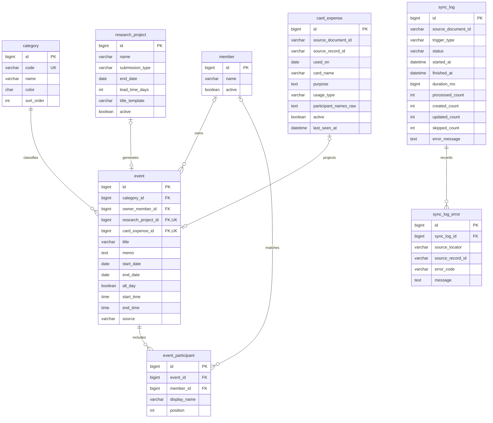

# KAN-27 ERD 및 DB 스키마 설계

작성일: 2026-09-06 · 상태: 팀 리뷰용 초안

기준: 프로젝트 루트의 `lab-calendar-proposal.docx`(2026-09-04), KAN-27 및 관련 Jira 요구사항. 현재 Spring Boot/JPA/MySQL 프로젝트에 적용할 설계다. DB나 애플리케이션 코드는 변경하지 않았다. 팀 리뷰 후 KAN-28에서 마이그레이션으로 구현한다.

## 1. 기획서와 설계의 대응

| 출처 | 요구사항 | 저장 모델 |
| --- | --- | --- |
| 2.1~2.2 | 카테고리 필터, 색상, 일정 등록, 월별 달력 | category, event |
| 2.2 | 업무명과 담당 연구원 | event.owner_member_id |
| 2.1, 3.2 | 참석자와 인원수, 상세 메모 | event_participant, event.memo |
| 3.1 | 과제 종료일, 3주 전부터 준비 기간 자동 생성 | research_project, 원천을 참조하는 event |
| 3.1 | D-Day와 임박 알림 | 종료일로 계산, 별도 카운트다운 테이블 불필요 |
| 3.2 | 카드 종류, 사용일, 목적, 회의/초과, 인원 | card_expense 및 연결 event/참석자 |
| KAN-27, 58, 60 | 반복 연동 중복 방지, 동기화 이력 | 원본 식별자 UNIQUE, sync_log, sync_log_error |
| KAN-21, 35 | 공용 비밀번호 EDITOR/VIEWER, 경비 비공개 | 카테고리 code 및 서비스 권한 정책 |

기획서 4장은 기술 제안으로 명시돼 있으므로 Node/Python으로 변경하지 않는다. 색상 역시 확정값이 아니므로 DB에 표시 색상을 보관한다. 기획서의 URL 접근은 Jira에서 결정한 2등급 인증을 적용한다. member는 연구원 명부이며 로그인 계정이 아니다. 계정·랩실 구분 테이블은 만들지 않는다.

기획서 2.2의 결제/승인 대기, 카드 수령자, 장비 예약, 정기 일정은 상세 업무 예시다. 별도의 승인 워크플로·카드 대여·장비 중복 예약 방지·반복 규칙 엔진까지 필요한지는 미확정이다. 1차 설계에서는 일반 일정/메모로 표현하며 이 자동화까지 지원한다고 간주하지 않는다.

## 2. ERD

card_expense에는 UNIQUE(source_document_id, source_record_id)를 둔다. 자동 생성 원천 하나당 일정은 최대 하나다. 수동 일정은 두 원천 FK가 모두 NULL이다. 오류 행별 사유를 남기기 위해 KAN-27의 초안 7개 테이블에 sync_log_error를 추가했다. 카드 내역은 여러 동기화에서 처리되므로 특정 sync_log에 종속시키지 않는다.

## 3. 공통 규칙

- PK/FK는 BIGINT, PK는 자동 증가. 별도 표시가 없으면 NOT NULL이다.
- category, member, research_project, event, event_participant, card_expense에는 `created_at`, `updated_at` DATETIME(6)을 추가한다. UTC 감사 시각이며 ERD에서 반복을 생략했다. sync_log는 실행 시각을 사용한다.
- InnoDB/utf8mb4 기준. 원본 ID는 대소문자를 구별한다. 실제 MySQL 버전, collation, CHECK 지원 및 H2 호환성은 KAN-28에서 확인한다.
- 구분값은 VARCHAR로 저장하고 허용값을 검증한다. FK 조합·범위는 서비스 검증과 가능한 DB CHECK로 보강한다.
- 일정 날짜/시간은 Asia/Seoul 기준이다. 감사 시각 UTC와 구분한다.

## 4. 컬럼 사전

### category

| 컬럼 | 타입 | 제약 및 의미 |
| --- | --- | --- |
| id | BIGINT | PK |
| code | VARCHAR(32) | UNIQUE, RESEARCH / LAB / CARD_EXPENSE, 불변 |
| name | VARCHAR(100) | 표시 이름 |
| color | CHAR(7) | #RRGGBB 형식, 변경 가능 |
| sort_order | INT | 0 이상 |

초기값 제안: 과제/연구 관리(RESEARCH, #DC2626), 랩실 주기적 일정(LAB, #16A34A), 카드/경비 사용(CARD_EXPENSE, #2563EB). 권한은 표시명이나 색상 대신 code로 판단한다. 카테고리 관리 API는 KAN-38 범위에서 제외한다.

### member

| 컬럼 | 타입 | 제약 및 의미 |
| --- | --- | --- |
| id | BIGINT | PK |
| name | VARCHAR(100) | 동명이인 허용, UNIQUE 금지 |
| active | BOOLEAN | 기본 true |

퇴실한 연구원은 비활성화한다. 참조 중인 연구원 물리 삭제는 제한한다.

### research_project

| 컬럼 | 타입 | 제약 및 의미 |
| --- | --- | --- |
| id | BIGINT | PK |
| name | VARCHAR(200) | 과제명 |
| submission_type | VARCHAR(100) | 연차보고서/최종보고서/학회 신청 등 |
| end_date | DATE | 마감일, 포함 |
| lead_time_days | INT | 기본 21, 0 이상. 주 입력은 일로 환산 |
| title_template | VARCHAR(500) | 기본 `[작성 요망] {과제명} {제출단계} 준비 시작` |
| active | BOOLEAN | 기본 true |

KAN-47~49에 맞춰 한 행은 제출 단계와 마감 하나를 관리한다. 동일 과제의 여러 제출 단계를 한 과제 아래 묶어야 한다면 project/milestone 분리가 필요하므로 리뷰에서 확인한다. 리드타임 규칙은 우선 행에 저장하며 별도 공통 규칙 테이블을 만들지 않는다. D-Day는 서울 기준 오늘과 마감일 차이로 계산하고 저장하지 않는다.

### event

| 컬럼 | 타입 | 제약 및 의미 |
| --- | --- | --- |
| id | BIGINT | PK |
| category_id | BIGINT | FK category |
| owner_member_id | BIGINT | FK member, NULL 허용, 담당자 1명 |
| research_project_id | BIGINT | FK research_project, UNIQUE, NULL 허용 |
| card_expense_id | BIGINT | FK card_expense, UNIQUE, NULL 허용 |
| title | VARCHAR(500) | 공백만 있는 제목 금지 |
| memo | TEXT | NULL 허용 |
| start_date / end_date | DATE | 양 끝 포함, end_date >= start_date |
| all_day | BOOLEAN | 기본 true |
| start_time / end_time | TIME(0) | 종일이면 둘 다 NULL, 시간 지정이면 둘 다 필수 |
| source | VARCHAR(20) | MANUAL / PROJECT / GOOGLE |

종일 하루 일정은 시작일=종료일이다. 시간 일정은 종료 날짜+시간이 시작 날짜+시간보다 커야 하며 종료 시각은 제외한다. 제목 템플릿 치환 결과도 500자 이내로 검증한다.

| source | 과제 FK | 카드 FK | 카테고리 |
| --- | --- | --- | --- |
| MANUAL | NULL | NULL | 세 종류 가능 |
| PROJECT | 필수 | NULL | RESEARCH |
| GOOGLE | NULL | 필수 | CARD_EXPENSE |

두 원천 FK를 동시에 설정할 수 없다. FK/source 조합은 DB 제약 대상으로, 다른 테이블의 카테고리 code 적합성은 서비스 검증 대상으로 둔다. 클라이언트가 source/원천 FK를 임의 변경하게 하지 않는다. 자동 생성 일정은 원천에서 수정하도록 하고 직접 수정/삭제는 거부하는 정책을 제안한다.

### event_participant

| 컬럼 | 타입 | 제약 및 의미 |
| --- | --- | --- |
| id | BIGINT | PK |
| event_id | BIGINT | FK event |
| member_id | BIGINT | FK member, 미등록 참석자는 NULL |
| display_name | VARCHAR(100) | 당시 이름 스냅샷, 필수 |
| position | INT | 0 이상, 표시 순서 |

UNIQUE(event_id, member_id), UNIQUE(event_id, position)를 둔다. 미등록 인원은 이름만 저장하며 자동으로 member를 생성하지 않는다. 이름만으로 동명이인을 합치거나 자동 연결하지 않는다. 참석 인원수는 행 수로 계산한다. 담당자가 참석하는 경우 참석자 행도 별도 등록한다.

기획서의 `홍길동, 김철수 등 총 3명`은 이름과 총원이 다를 수 있다. 초안은 한 사람당 한 행을 요구한다. 실제 원본에 `외 1명`처럼 익명 인원이 존재하면 anonymous_count 또는 익명 참석자 모델을 추가해야 하므로 KAN-54에서 확인한다.

### card_expense

| 컬럼 | 타입 | 제약 및 의미 |
| --- | --- | --- |
| id | BIGINT | PK |
| source_document_id | VARCHAR(191) | 원본 문서 ID |
| source_record_id | VARCHAR(191) | 이동/내용 수정에도 유지되는 문서 내 레코드 ID |
| used_on | DATE | 사용 일자 |
| card_name | VARCHAR(100) | 카드 종류/표시 이름 |
| purpose | TEXT | 지출 목적 |
| usage_type | VARCHAR(50) | 회의/초과 구분. 정확한 의미·허용값은 KAN-54에서 확정 |
| participant_names_raw | TEXT | NULL 허용, 원본 인원 문자열 |
| active | BOOLEAN | 기본 true |
| last_seen_at | DATETIME(6) | 마지막 정상 확인 시각, UTC |

UNIQUE(source_document_id, source_record_id)로 멱등성을 보장한다. 행 번호나 내용 해시는 정렬/수정 때 바뀌므로 원본 ID로 쓰지 않는다. Docs/Sheets 양식에 UUID 등 안정적인 ID를 확보하는 방식은 선행 합의 사항이다. 확보 전에는 변경 추적이 해결됐다고 간주하지 않는다.

일정 제목은 3.2의 카드 종류(`[법인카드 A]`)를 기본 제안으로 삼는다. 2.2의 `카드종류: [지출목적]`과 표현이 다르므로 UI 리뷰에서 확정한다. card_name/purpose를 분리 저장해 어느 형식도 지원한다. 날짜·제목·메모·참석자는 원본에서 연결 event로 투영하고 같은 트랜잭션에서 갱신한다. 금액은 필수 입력으로 명시되지 않아 추가하지 않았다.

### sync_log 및 sync_log_error

| 컬럼 | 타입 | 제약 및 의미 |
| --- | --- | --- |
| sync_log.id | BIGINT | PK |
| source_document_id | VARCHAR(191) | 대상 문서 |
| trigger_type | VARCHAR(20) | SCHEDULED / MANUAL |
| status | VARCHAR(20) | RUNNING / SUCCESS / PARTIAL / FAILED |
| started_at | DATETIME(6) | UTC |
| finished_at | DATETIME(6) | 실행 중 NULL 허용 |
| duration_ms | BIGINT | 실행 중 NULL 허용, 완료 시 0 이상 |
| processed_count | INT | 기본 0, 정상 처리 행 수(변경 없는 행 포함) |
| created_count / updated_count | INT | 각각 기본 0, 정상 처리 중 생성/갱신 수 |
| skipped_count | INT | 기본 0, 오류로 건너뛴 행 수 |
| error_message | TEXT | NULL 허용, 실행 수준 오류 요약 |
| sync_log_error.id | BIGINT | PK |
| sync_log_id | BIGINT | FK sync_log |
| source_locator | VARCHAR(255) | 해당 실행의 표/시트/행 위치 |
| source_record_id | VARCHAR(191) | NULL 허용, ID를 못 읽은 행도 기록 |
| error_code | VARCHAR(50) | 오류 분류 |
| message | TEXT | 원인, 비밀키/원문 전체 내용 제외 |

카운터는 모두 0 이상이며 생성+갱신 <= 정상 처리 수다. 일부 행 실패는 PARTIAL이다. RUNNING 잔류 정리 및 보존 기간은 KAN-59/60에서 결정한다. 실패 로그는 데이터 반영 롤백 후에도 남도록 별도 트랜잭션에서 기록한다.

## 5. 기간 조회와 인덱스

API 날짜 범위는 `[from, to)`로 제안한다. 종일 저장 날짜는 양 끝 포함이므로 `start_date < to AND end_date >= from`으로 겹침을 조회한다. 시간 일정이 from의 00:00에 정확히 끝나는 경우는 추가 제외한다. 종일 일정의 화면 종료일을 제외 형식으로 내보낼 때는 저장 end_date에 1일을 더하고 입력은 역변환한다. 프론트와 이 계약을 합의한다.

| 테이블 | 인덱스/제약 | 목적 |
| --- | --- | --- |
| category | UNIQUE(code) | 안정적인 분류 |
| event | INDEX(start_date, end_date) | 기간 후보 조회 |
| event | INDEX(category_id, start_date, end_date) | 카테고리 필터 |
| event | UNIQUE(research_project_id), UNIQUE(card_expense_id) | 원천별 일정 중복 방지 |
| event | INDEX(owner_member_id) | 담당자 FK |
| event_participant | 위 복합 UNIQUE 2개, INDEX(member_id) | 참석자 조회/중복 방지/FK |
| research_project | INDEX(active, end_date) | 활성 과제의 임박순 조회 |
| card_expense | 원본 복합 UNIQUE | 원본 식별/upsert |
| sync_log | INDEX(source_document_id, started_at, id) | 문서별 최신 이력 |
| sync_log_error | INDEX(sync_log_id) | 실패 행 조회 |

NULL 원천 FK의 유니크는 여러 수동 일정을 허용해야 한다. 실제 DB와 H2에서 KAN-28 검증 항목으로 둔다. 날짜 복합 인덱스가 양쪽 범위 조건을 모두 해결한다고 가정하지 않고 KAN-40에서 실행 계획을 확인한다. 참석자/카테고리는 일괄 조회 전략으로 N+1을 방지한다.

VIEWER에는 CARD_EXPENSE 카테고리 및 GOOGLE 원천 일정을 제외한다. 목록뿐 아니라 일정 단건/참석자/카테고리 조회에 같은 서비스 정책을 적용하고 카드/동기화 API를 차단한다. UI에서 숨기는 것만으로 처리하지 않는다.

## 6. 변경과 삭제 정책

- category/member 참조 FK는 삭제 RESTRICT. 연구원은 비활성화한다.
- event 삭제 시 event_participant만 CASCADE로 정리한다.
- 과제 삭제/비활성화는 서비스 트랜잭션에서 생성 일정부터 정리한다. 과제 FK는 RESTRICT로 누락을 방지한다.
- 카드 원본 행 삭제는 card_expense 비활성화와 생성 일정 삭제로 처리하는 안을 제안한다. 카드 FK도 RESTRICT다. 다시 나타난 원본 ID는 재활성화한다.
- 누락 삭제 판정은 전체 원본을 정상 조회/파싱한 경우에만 수행한다. API 실패나 파싱 오류를 원본 삭제로 오인하지 않는다.
- sync_log 삭제 시 오류 행만 CASCADE. 구체 보존 기간은 운영 리뷰에서 결정한다.
- 반복 배치는 과제 FK, 카드 동기화는 원본 복합 키 및 카드 FK로 upsert한다. `조회 후 삽입`만으로 동시성을 보장하지 않고 DB UNIQUE와 충돌 처리를 사용한다.
- 원천별 동시 실행을 직렬화하고 카드/일정/참석자를 함께 커밋한다. 여러 서버에서의 잠금 구현은 KAN-49/59에서 정한다.

## 7. 설계 검증 시나리오

아래는 구현 테스트가 아니라 리뷰 예시다.

| 입력/상황 | 기대 결과 |
| --- | --- |
| 9/6 종일 | 시작일=종료일=9/6, 화면용 종료 제외 날짜는 9/7 |
| 8/30~9/2 또는 9/30~10/2, 9월 조회 | 모두 포함 |
| 10/1 시작, 9월 조회 | 제외 |
| 8/31 23:00~9/1 00:00, 9월 조회 | 제외 |
| 종료일 < 시작일 | 검증 실패 |
| 2027-04-30 마감, 21일 리드타임 | 2027-04-09~04-30 준비 일정 |
| 동일 과제 배치 2회 | 일정 1개 |
| 동일 원본 ID 내용 수정/행 이동 | 기존 카드 및 일정 갱신 |
| 문서 일부 파싱 실패 | 오류 기록, 누락 삭제 금지 |
| 동명이인 | 서로 다른 연구원 ID 유지 |
| VIEWER가 카드 일정 단건 요청 | 경비 데이터 노출 없음 |

## 8. 팀 리뷰 체크리스트

- [ ] 날짜 포함/제외, 시간 및 서울 시간대 계약
- [ ] 과제 한 행에 제출 단계·마감 하나인 모델
- [ ] 원천 생성 일정 직접 수정 금지 및 삭제/재등장 정책
- [ ] 참석자 이름 스냅샷, 미등록 인원 및 익명 인원 처리
- [ ] KAN-54: Docs/Sheets와 안정적인 원본 ID, 회의/초과 의미 확정
- [ ] 카드 제목 형식 및 2.2 업무 예시의 별도 자동화 범위 확인
- [ ] 컬럼 타입·길이·FK·인덱스 및 색상 리뷰
- [ ] 저장소에 커밋/공유하고 팀 리뷰 결과 기록

KAN-27의 완료 조건은 문서 공유와 팀 리뷰 후 확정이다. 현재는 로컬 설계 초안이다. 리뷰 후 KAN-28에서 빈 MySQL DB 마이그레이션, JPA validate, 제약조건과 테스트 DB 호환성을 검증한다. 구글 양식이 미정이면 카드 관련 적용을 후속 마이그레이션으로 분리하고 일정 기반을 먼저 진행할 수 있다.

## 9. 참고 티켓

[KAN-27 설계](https://jjhong12122.atlassian.net/browse/KAN-27), [KAN-21 인증](https://jjhong12122.atlassian.net/browse/KAN-21), [KAN-35 권한](https://jjhong12122.atlassian.net/browse/KAN-35), [KAN-38 카테고리](https://jjhong12122.atlassian.net/browse/KAN-38), [KAN-39 일정](https://jjhong12122.atlassian.net/browse/KAN-39), [KAN-40 조회](https://jjhong12122.atlassian.net/browse/KAN-40), [KAN-41 참석자](https://jjhong12122.atlassian.net/browse/KAN-41), [KAN-47 과제](https://jjhong12122.atlassian.net/browse/KAN-47), [KAN-48 리드타임](https://jjhong12122.atlassian.net/browse/KAN-48), [KAN-49 배치](https://jjhong12122.atlassian.net/browse/KAN-49), [KAN-54 원천](https://jjhong12122.atlassian.net/browse/KAN-54), [KAN-58 동기화](https://jjhong12122.atlassian.net/browse/KAN-58), [KAN-60 이력](https://jjhong12122.atlassian.net/browse/KAN-60).
